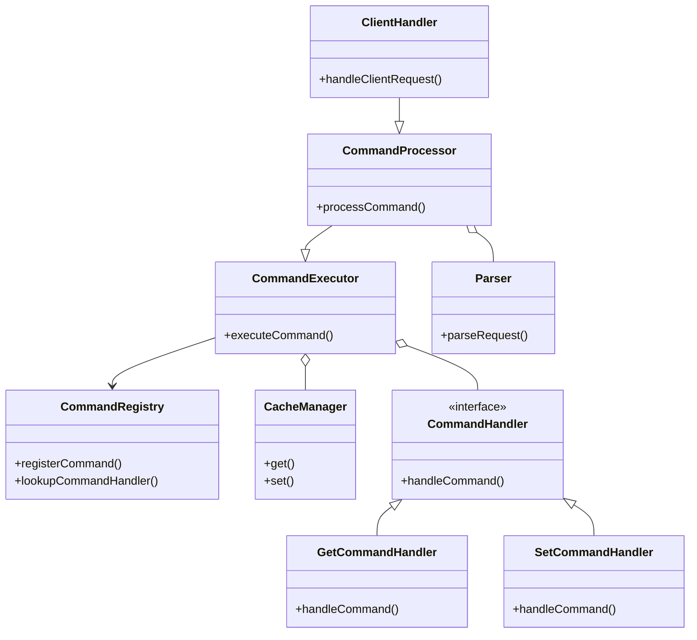

```mermaid
classDiagram
    class ClientHandler {
        +handleClientRequest()
    }
    class CommandProcessor {
        +processCommand()
    }
    class CommandExecutor {
        +executeCommand()
    }
    class CommandRegistry {
        +registerCommand()
        +lookupCommandHandler()
    }
    class CacheManager {
        +get()
        +set()
    }
    class Parser {
        +parseRequest()
    }
    class CommandHandler {
        <<interface>>
        +handleCommand()
    }
    class GetCommandHandler {
        +handleCommand()
    }
    class SetCommandHandler {
        +handleCommand()
    }

    ClientHandler --|> CommandProcessor
    CommandProcessor --|> CommandExecutor
    CommandExecutor --> CommandRegistry
    CommandExecutor o-- CommandHandler
    CommandHandler <|-- GetCommandHandler
    CommandHandler <|-- SetCommandHandler
    CommandExecutor o-- CacheManager
    CommandProcessor o-- Parser
```