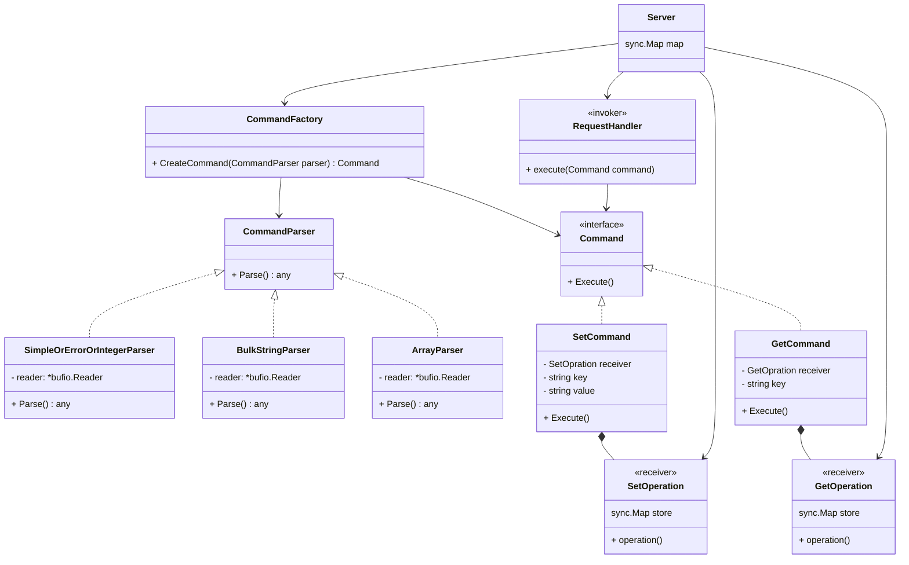

```mermaid
classDiagram
    class Server {
        sync.Map map    
    }

    class CommandParser {
        + Parse() any
    }
    class SimpleOrErrorOrIntegerParser {
        - reader: *bufio.Reader
        + Parse() any
    }
    class BulkStringParser {
        - reader: *bufio.Reader
        + Parse() any
    }
    class ArrayParser {
        - reader: *bufio.Reader
        + Parse() any
    }
    
    CommandParser <|.. SimpleOrErrorOrIntegerParser
    CommandParser <|.. BulkStringParser
    CommandParser <|.. ArrayParser

    class CommandFactory {
        + CreateCommand(CommandParser parser) Command
    }
    CommandFactory --> CommandParser
    CommandFactory --> Command

    class Command {
        <<interface>>
        + Execute()
    }

    class SetCommand {
        - SetOpration receiver
        - string key
        - string value
        + Execute()
    }
    class GetCommand {
        - GetOpration receiver
        - string key
        + Execute()
    }

    Command <|.. SetCommand
    Command <|.. GetCommand

    class RequestHandler {
        <<invoker>>
        + execute(Command command)
    }

    RequestHandler --> Command

    class GetOperation {
        <<receiver>>
        sync.Map store
        + operation()
    }
    class SetOperation {
        <<receiver>>
        sync.Map store
        + operation()
    }

    GetCommand *-- GetOperation
    SetCommand *-- SetOperation

    Server --> CommandFactory
    Server --> RequestHandler

    Server --> SetOperation
    Server --> GetOperation
```